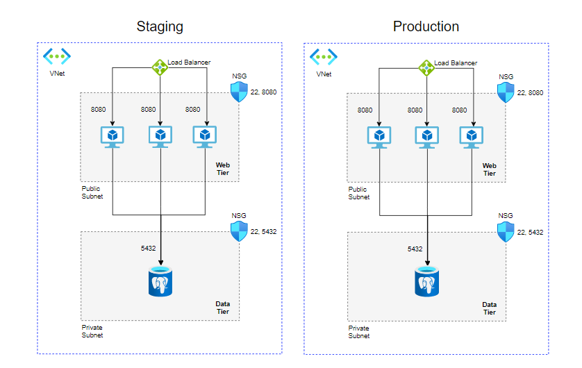

# Weight Tracker Ansible Docker Container 


 This project demonstrates the deployment of docker containers by using Ansible.

The requested infrastructure:




## Configuration

* An azure devops agent with this project is added for each environment.

* The role **app_deploy** is responsible for pulling the image from the azure private container registry and start the container on the target environments.

* A variable file added for each of the environments.

*  Variable files for hosts, variable file for Postgres details, hosts details for host file to use with Ansible are exported from terraform.


* The playbook starts automatically by the ci-cd pipeline.

* Variable files are encrypted with Ansible Vault.


```
├── ansible-agent
│   ├── README.md
│   ├── ansible.cfg
│   ├── app_deploy_playbook.yml
│   ├── doc
│   │   └── project6.png
│   ├── inventory
│   │   ├── production
│   │   │   ├── host
│   │   │   └── host_vars
│   │   ├── staging
│   │   │   ├── host
│   │   │   └── host_vars
│   │   │       ├── web-server-1-staging.yml
│   │   │       └── web-server-2-staging.yml
│   │   └── webservers_vars
│   │       └── webservers_vars.yml
│   └── roles
│       └── app_deploy
│           ├── tasks
│           │   └── main.yml
│           └── templates
│               └── env.j2
```
